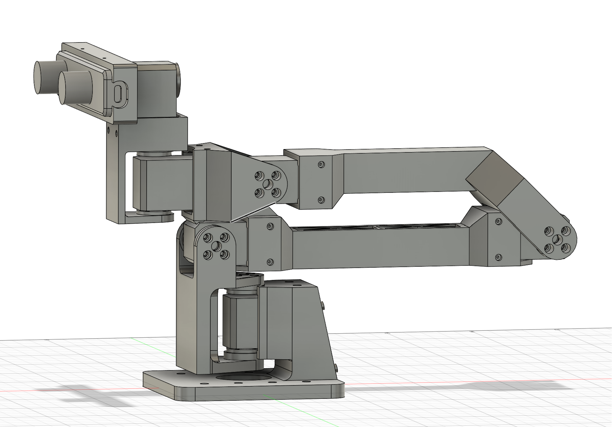

# CamBot

<p align="center">
  
</p>

6-DOF camera arm for stereo vision, built with Feetech STS3215 servos and a ZED Mini stereo camera. Includes a VR teleop system for real-time head tracking from a Meta Quest 3.

**[Build & Assembly Guide](docs/BUILD_GUIDE.md)**

## Hardware

- **Servos:** 6x Feetech STS3215 (serial bus, 1 Mbaud, `/dev/ttyACM0`)
- **Camera:** ZED Mini (63mm baseline stereo)
- **Joints:** base_yaw, shoulder_pitch, elbow_pitch, wrist_pitch, wrist_yaw, camera_roll

## Project Structure

```
cambot/
  servo/              Shared servo communication layer
    constants.py      Register addresses, motor config, conversions
    protocol.py       Wire protocol (decode/encode, connect, EPROM helpers)
    controller.py     CamBotServo class, save/load calibration
  teleop/             VR teleop application
    app.py            Main entry point (TeleHead control loop)
    server.py         HTTPS + WebSocket server (aiohttp)
    ik_solver.py      IK solver (ikpy + URDF)
    capture.py        ZED Mini / fallback camera capture
    webrtc.py         WebRTC H.264 video track
    client/           Quest 3 VR viewer (Three.js + WebXR)
  tools/              CLI diagnostic and setup tools
    fix_servo_ids.py  Scan and assign servo IDs
    read_params.py    Register dump / read / write
    set_pid.py        Write tested PID parameters to servos
    debug_control.py  Debug TUI with IK visualization
    pid_tuning.py     PID auto-tuner
    visualize_urdf.py URDF visualization (viser)
calibration/          Saved positions and calibration data
urdf/                 URDF model and STL meshes
3dprint/              STL files for 3D printing (mm scale)
docs/                 Datasheets and manuals
```

## Setup

```bash
uv pip install -e .              # install cambot package (editable)
uv pip install -e ".[viz]"       # + URDF visualization (viser)
uv pip install -e ".[webrtc]"    # + WebRTC streaming (aiortc)
```

For ZED Mini support, install pyzed from the ZED SDK (not PyPI):
```bash
/usr/local/zed/get_python_api.py
```

## VR Teleop

Stream stereo video to a Meta Quest 3 and control the robot arm with head tracking:

```bash
./run_teleop.sh                              # full mode
./run_teleop.sh --no-robot                   # camera streaming only
./run_teleop.sh --no-camera                  # robot control only
./run_teleop.sh --no-zed                     # use fallback camera
```

Open the displayed HTTPS URL on the Quest 3, enter VR, then press Enter in the terminal to calibrate the neutral head position. Press P to toggle position tracking.

### Safety features

Position tracking mode has built-in safety limits:

- **Position delta sphere** (default 15cm): limits end-effector displacement from home. `--max-pos-delta 0.20` for 20cm, or `--max-pos-delta 0` to disable.
- **Workspace bounding box**: hard axis-aligned limits in robot frame. `--workspace-bounds xmin,xmax,ymin,ymax,zmin,zmax` (meters). Auto-disables the default sphere.
- **Pose watchdog** (default 3s): smoothly returns to home if VR data stops (headset removed, connection lost). `--watchdog-timeout 5.0` or `--watchdog-timeout 0` to disable.

Additional safety: EMA smoothing, velocity clamping (20 rad/s), FK validation, torque limiting (90%).

## Tools

All tools have shell script wrappers in the project root:

```bash
./run_fix_servo_ids.sh           # scan/set servo IDs
./run_read_params.sh             # register dump
./run_set_pid.sh                 # write tested PID values to servos
./run_debug_control.sh           # debug TUI with IK
./run_pid_tuning.sh              # PID auto-tuner
./run_visualize_urdf.sh          # URDF 3D viewer (browser)
```

Or run directly as Python modules: `uv run python -m cambot.tools.debug_control`

## Dependencies

- Python 3.12+
- `feetech-servo-sdk` (servo communication, imported as `scservo_sdk`)
- `numpy`, `scipy`, `ikpy` (IK solver)
- `aiohttp`, `opencv-python` (teleop server + video)
- Optional: `pyzed` (ZED SDK), `viser` (URDF viz), `aiortc` (WebRTC)
