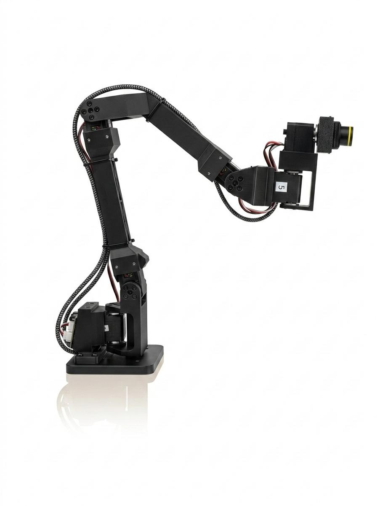

# CamBot Build & Assembly Guide

## Parts List

| Part | Qty | Notes |
|------|-----|-------|
| Feetech STS3215-C001 7.4V (1:345) | 3 | base_yaw, shoulder_pitch, elbow_pitch — high torque for structural joints |
| Feetech STS3215-C046 7.4V (1:147) | 3 | wrist_pitch, wrist_yaw, camera_roll — faster for orientation changes |
| Waveshare Bus Servo Adapter (A) | 1 | USB serial bus controller ([Amazon](https://amzn.eu/d/04b0u8LV)) |
| LEICKE Power supply 5V 4A 20W | 1 | Powers servo bus via adapter ([Amazon](https://amzn.eu/d/03hZC3xp)) |
| StereoLabs ZED Mini | 1 | USB 3.1 stereo camera, 63mm baseline ([Store](https://www.stereolabs.com/en-de/store/products/zed-mini)) |
| 3D printed parts | 7 | See printing section below |

For sourcing servos, the bus controller, power supply, USB cables, and screwdriver set, see the [SO-ARM100 repository](https://github.com/TheRobotStudio/SO-ARM100) — CamBot uses the same servo platform.

## 3D Printing

**Printer:** Bambu Lab A1 ([bambulab.com](https://bambulab.com/en/a1)) or similar FDM printer

**Filament:** eSUN PLA Basic 1.75mm (any rigid PLA works)

**Settings:**
- 25% infill (gyroid or grid)
- Tree supports (auto)
- 4 wall loops for rigidity

**Files:**
- Full Bambu Studio plate: `3dprint/CamBot_v2.3mf`
- Individual STLs in `3dprint/`:
  - `CamBot_Baseplate.stl`
  - `CamBot_Link1.stl` through `CamBot_Link5.stl`
  - `CamBot_ZedMiniMount.stl`

## Motor Configuration (Before Assembly)

### 1. Set Motor IDs

Connect only **one motor at a time** to the bus and assign IDs 1-6:

```bash
./run_fix_servo_ids.sh --set-id 1   # base_yaw
./run_fix_servo_ids.sh --set-id 2   # shoulder_pitch
./run_fix_servo_ids.sh --set-id 3   # elbow_pitch
./run_fix_servo_ids.sh --set-id 4   # wrist_pitch
./run_fix_servo_ids.sh --set-id 5   # wrist_yaw
./run_fix_servo_ids.sh --set-id 6   # camera_roll
```

### 2. Set PID & Torque Parameters

Connect all motors to the bus, then write the tested PID and torque values:

```bash
./run_set_pid.sh            # write recommended PID + torque settings
./run_set_pid.sh --dry-run  # preview values without writing
```

The recommended PID values (factory defaults are P=16, D=32, I=0):

| Joint | ID | Servo | P | D | I |
|-------|---:|-------|--:|--:|--:|
| base_yaw | 1 | C001 (1:345) | 24 | 48 | 0 |
| shoulder_pitch | 2 | C001 (1:345) | 32 | 16 | 0 |
| elbow_pitch | 3 | C001 (1:345) | 64 | 32 | 0 |
| wrist_pitch | 4 | C046 (1:147) | 48 | 32 | 0 |
| wrist_yaw | 5 | C046 (1:147) | 32 | 32 | 0 |
| camera_roll | 6 | C046 (1:147) | 25 | 32 | 0 |

These values were tuned for smooth VR teleop tracking. The C001 high-torque joints (base, shoulder, elbow) need different gains than the C046 fast joints (wrist, camera) due to their different gear ratios.

The script also writes torque protection settings:
- **Overload_Torque = 95** for motors 1-5 (factory default is 25). The factory value is too low — load-bearing joints (especially shoulder_pitch) constantly fight gravity, causing the servo to trip overload protection during normal operation. Setting it to 95 allows up to 95% of maximum torque before protection activates.
- **Max_Torque_Limit = 500** (50%) for camera_roll — no need for full torque on camera rotation.

A full reference dump of all register values is available in [`docs/reference_params.txt`](reference_params.txt).

### 3. Verify

```bash
./run_read_params.sh        # full register dump — check PID, ID, mode
```

## Assembly

1. Label each servo with its ID (1-6) before assembly — they are indistinguishable once mounted.
2. Assemble from base to camera: Baseplate -> Link1 -> Link2 -> Link3 -> Link4 -> Link5 -> ZedMiniMount.
3. Route servo cables through the links. Daisy-chain all servos on the same bus.
4. Apply medium-strength threadlocker (e.g. Loctite 243) to the servo flange screws — vibrations will loosen them over time.
5. Mount the ZED Mini camera on the top link using the printed mount.

## Calibration

After assembly, calibrate the two reference poses:

### 1. URDF Zero (Resting) Pose

Position the arm in the resting pose shown below. This defines the URDF zero reference for the IK solver.


```bash
./run_teleop.sh --save-resting
# or use debug_control: ./run_debug_control.sh then press Z
```

### 2. Home Pose

Move the arm to the starting camera position for VR teleop (where the camera faces forward at a comfortable viewing angle). The photo below shows an example home pose used during testing:



```bash
./run_teleop.sh --save-home
# or use debug_control: ./run_debug_control.sh then press H
```

## Running

```bash
./run_teleop.sh                    # full VR teleop (robot + camera + WebRTC)
./run_teleop.sh --no-robot         # camera streaming only (no servos)
./run_teleop.sh --no-camera        # robot control only (no video)
./run_teleop.sh --no-zed           # use fallback USB camera
```

Open the displayed HTTPS URL in the headset browser, enter VR, then press Enter in the terminal to calibrate the neutral head position.

## PID Tuning (Optional, Advanced)

The default PID values set by `run_set_pid.sh` work well for general use. If you want to tune for your specific build (different filament or payload), there are two approaches:

### Interactive tuning with debug_control

```bash
./run_debug_control.sh
```

Switch to PID mode (press `P` in the TUI) to adjust P, D, and I gains per joint in real time while watching the servo response. This is the best way to get a feel for how each parameter affects tracking behavior — you can command step moves and immediately see overshoot, settling time, and steady-state error.

### Automated tuning (experimental)

> **Warning:** Automated tuning is experimental and puts the hardware under stress. It commands rapid step moves at various gain levels, which can cause jerky motion and high transient loads on the servos and 3D printed parts. Supervise the robot during tuning and be ready to kill the script if anything sounds or looks wrong.

```bash
uv run cambot-pid-tuning --capture-poses           # capture test poses first
uv run cambot-pid-tuning --joints shoulder_pitch    # tune a specific joint
uv run cambot-pid-tuning --verbose                  # tune all joints with detailed output
uv run cambot-pid-tuning --restore-factory          # reset to factory PID defaults
```

Runs automated step-response tests and searches for gains that minimize overshoot and settling time.

If you find better PID values for your build, please share them by [opening a GitHub issue](https://github.com/open-thought/cambot/issues).
